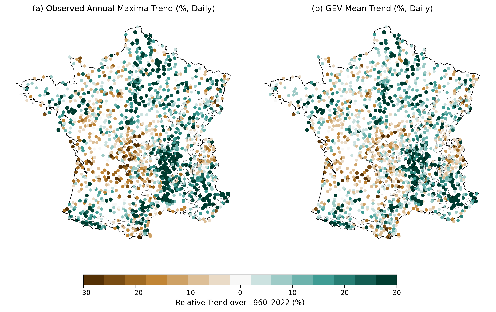
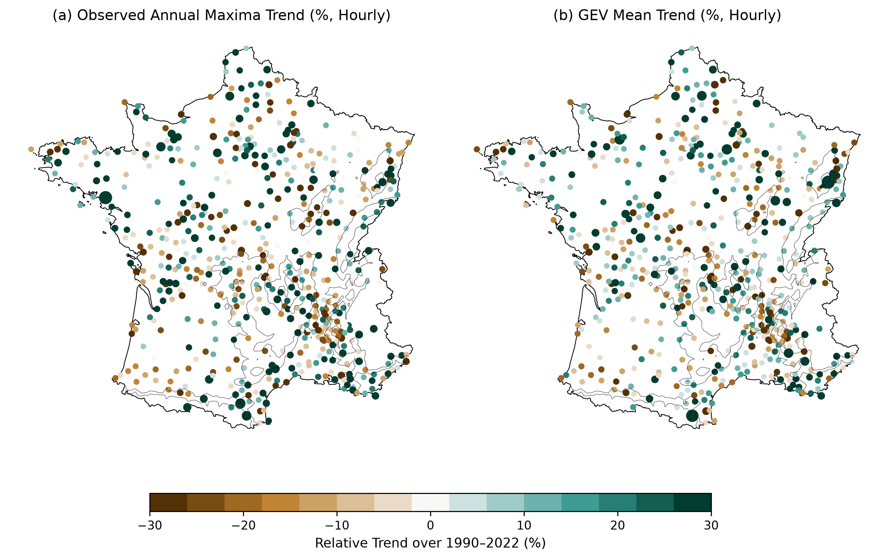

**Manuscript Title:** Climatology and trends of extreme precipitation in France: evaluation of an explicit-convection regional climate model

**Authors:** Nicolas Decoopman, Juliette Blanchet, Antoine Blanc, and Cecile Caillaud

**Journal:** Hydrology and Earth System Sciences (HESS)

We thank referee #1 for his/her constructive and detailed review of our manuscript. Below are our point-by-point responses to the comments, with line and figure numbers referring to the manuscript.

## Main Comments

## Comment 1: Annual Maxima Trends

_Considering that you are not looking at very rare extremes (10-yr return level), I suggest to look also at trend in Annual Maxima, that is not affected by uncertainty in fitting a 3-parameters distribution like GEV, in order to compare/confirm your patterns._

* **Response:** We thank the reviewer for this constructive suggestion. We agree that comparing the trend of annual maxima with GEV-based return level trends is a useful check. However, a direct comparison between the trend of the annual maxima and that of the 10-year return level ($RL_{10y}$) is not fully consistent because they represent different quantiles and do not necessarily share the same trend. Instead, to perform a directly comparable analysis, we compare the trend of the annual maxima (obtained via a simple linear regression) with the trend of the GEV-estimated mean, since the mean of a GEV is an analytical function of its parameters ($\mu$, $\sigma$, $\xi$) and can be compared directly to the linear regression.

We have performed this consistency check across all 1,558 daily stations (hydrological year, 1960–2022). For the GEV mean, we computed the mean at the start and end of the record using the selected best model parameters. For the annual maxima, we fitted a simple linear regression. 

Both the spatial patterns (regional trends) and magnitude/sign of the trends show an extremely strong agreement across the stations, with some minor differences to note:

- **Spatial patterns**: The maps of observed annual maxima trend (@fig-maxima-gev-maps-daily a) and GEV-estimated mean trend (@fig-maxima-gev-maps-daily b) show identical regional patterns, with the strongest positive trends concentrated in the Southern Alps and the Rhone valley.
- **Quantitative agreement**: The Pearson correlation coefficient is **$r = 0.86$** for absolute trends (mm/decade, @fig-maxima-gev-scatter-daily a) and **$r = 0.88$** for relative trends (%, @fig-maxima-gev-scatter-daily b). The regression fit line (red) is very close to the 1:1 diagonal (grey dashed), confirming that the GEV-estimated trends are highly robust and not significantly affected by parameter fitting uncertainty.
- **Dampening / Smoothing**: The regression slope for the relative trends is **$0.80$** (@fig-maxima-gev-scatter-daily b), indicating that GEV-estimated trends are on average slightly smaller (dampened by about 20%) than those obtained by simple linear regression. This difference is expected because non-stationary GEV parameters are estimated via maximum likelihood over the entire distribution of annual maxima, allowing extreme values to be modeled by the scale and shape parameters. This makes the GEV mean trend less sensitive to individual extreme outliers (especially at the boundaries of the series) than Ordinary Least Squares (OLS) linear regression, which minimizes squared residuals.

We have also extended this consistency check to the hourly scale across all 562 hourly stations (hydrological year, 1990–2022). Despite the much shorter record length (33 years vs 63 years) and the higher spatial and temporal noise typical of sub-daily convective extremes, the hourly GEV mean trends show a strong agreement with the raw annual maxima trends:

- **Spatial patterns**: The maps of observed hourly annual maxima trend (@fig-maxima-gev-maps-hourly a) and GEV-estimated hourly mean trend (@fig-maxima-gev-maps-hourly b) show highly consistent spatial patterns.
- **Quantitative agreement**: The Pearson correlation coefficient is **$r = 0.72$** for absolute trends (mm/decade, @fig-maxima-gev-scatter-hourly a) and **$r = 0.70$** for relative trends (%, @fig-maxima-gev-scatter-hourly b).
- **Dampening / Smoothing**: The regression slope is **$0.71$** (@fig-maxima-gev-scatter-hourly b), showing a moderate dampening (about 30%) for GEV-estimated trends. This is again expected due to the robustness of GEV maximum likelihood estimation against individual outlier years in short records.

**Manuscript modifications:** In the revised manuscript, we have added the following introductory paragraphs to `Section 4.2.1 (Daily)` and `Section 4.2.2 (Hourly)`:

- In `Section 4.2.1 (Daily)` (at the very beginning):
  > _"Before analyzing trends in daily return levels, we verified the consistency of GEV-estimated trends in the mean against those obtained via a simple linear regression on observed annual maxima. This preliminary check shows a very strong spatial and quantitative agreement (Pearson correlation $r = 0.86$ for absolute trends, $r = 0.88$ for relative trends), confirming the robustness of the statistical fits."_

- In `Section 4.2.2 (Hourly)` (at the very beginning):
  > _"Similarly to the daily scale, we verified the consistency of GEV hourly trends by comparing GEV-estimated trends in the mean to linear regression trends of observed annual maxima. Despite the shorter record length and the higher noise level of sub-daily extremes, we find a robust agreement (Pearson correlation $r = 0.72$ for absolute trends, $r = 0.70$ for relative trends)."_

\clearpage

{#fig-maxima-gev-maps-daily width=62%}

{#fig-maxima-gev-scatter-daily width=60%}

\clearpage

{#fig-maxima-gev-maps-hourly width=62%}

{#fig-maxima-gev-scatter-hourly width=60%}

\clearpage

## Comment 2: Redundancy of $M^{*}$ Models for Hourly Data

_Hourly data mostly starts in 1990. Thus, the $M$ models are applied just to the daily case, right? Do you really need 6 non-stationary models? In how many cases the $M^*$ models resulted better than the $M$ ones?_

* **Response:** We appreciate this comment. Indeed, for the hourly case (1990-2022), because the records begin after 1985, the breakpoint models ($M^{*}$) are mathematically equivalent to the standard linear models ($M$) since all observations lie after the breakpoint ($t\geq 1985$). For the daily case (1959-2022), the $M^{*}$ models represent a physical hypothesis of a trend emerging in the mid-1980s.

To address this comment, we present the table below (@tbl-mstar-selection) showing the full breakdown of selected models: the stationary model ($M_0$, representing no significant trend at the 10% significance level), standard linear trend models ($M$), and breakpoint models ($M^*$). In this way, the percentages for each subset sum to 100%.

For the grid point percentages (AROME), the statistics are calculated over the entire domain of mainland France. To ensure this does not introduce spatial representation biases, we also computed these statistics restricted only to the grid points closest to the daily stations ($N = 7,486$). The results are highly consistent: for the Annual period, selection rates at matched grid points are 75.6% for $M_0$, 11.3% for $M$, and 13.0% for $M^*$ (compared to 75.5%, 11.8%, and 12.7% over all mainland grid points). We therefore present the full-grid statistics in the table to reflect the complete spatial support of the model.

::: {#tbl-mstar-selection}

\centering
\begin{tabular}{lcccccc}
\hline
\textbf{Period} & \multicolumn{3}{c}{\textbf{Stations (Obs.)}} & \multicolumn{3}{c}{\textbf{Grid Points (AROME)}} \\
\cline{2-4} \cline{5-7}
 & \textbf{$M_0$} & \textbf{$M$} & \textbf{$M^*$} & \textbf{$M_0$} & \textbf{$M$} & \textbf{$M^*$} \\
\hline
\textbf{Annual} (YEAR) & 66.1\% & 17.8\% & 16.0\% & 75.5\% & 11.8\% & 12.7\% \\
\textbf{Autumn} (OND)  & 62.8\% & 16.2\% & 21.0\% & 73.5\% & 7.9\%  & 18.6\% \\
\textbf{Winter} (JFM)  & 64.5\% & 22.6\% & 12.9\% & 65.6\% & 22.5\% & 11.9\% \\
\textbf{Spring} (AMJ)  & 62.1\% & 16.6\% & 21.3\% & 75.0\% & 11.7\% & 13.3\% \\
\textbf{Summer} (JAS)  & 68.8\% & 14.2\% & 17.1\% & 65.6\% & 10.5\% & 24.0\% \\
\hline
\end{tabular}

Percentage of locations where each model category is selected as the best fit for daily precipitation extremes ($M_0$ representing no trend, $M$ a linear trend, and $M^*$ a breakpoint trend starting in 1985). All percentages sum to 100\% for each subset.
:::

**Manuscript modifications:** 

- In `Section 3.2.2 (Model selection)`, we have explicitly clarified that the model selection procedure defaults to the standard linear models ($M$) for the hourly series.
- In `Section 4.2.1 (Daily)`, we have added a sentence stating the percentage of stations and grid points where $M_0$, $M$, and $M^*$ models were selected.
- In `Section 4.2.2 (Hourly)`, we have added a sentence stating the percentage of stations and grid points where $M_0$ and $M$ models were selected.

## Comment 3: Rationale for the Two-Step Model Selection

_Not clear to me why you use the 2-step procedure, why not simply choosing the model with the smallest p-value?_

* **Response:** We agree that the rationale behind this selection procedure should be explained more clearly. The likelihood ratio test compares each non-stationary model $M_{j}$ ($j\geq 1$) to the stationary model $M_{0}$. However, models $M_{3}$ and $M_{3}^{*}$ (where both $\mu$ and $\sigma$ vary over time) have 2 degrees of freedom more than $M_{0}$, whereas models $M_{1}/M_{1}^{*}$ and $M_{2}/M_{2}^{*}$ have only 1 degree of freedom more. Choosing the model with the absolute smallest p-value across different degrees of freedom can bias the selection toward simpler and thus more constrained models. Our 2-step procedure is designed to first test if a trend in both location and scale ($M_{3}$ or $M_{3}^{*}$) is statistically justified. If it is not, we look at whether a simpler trend in either location only ($M_{1}/M_{1}^{*}$) or scale only ($M_{2}/M_{2}^{*}$) is justified. This favors more flexible models (i.e. both parameters changing) when statistically supported.

**Manuscript modifications:**

- In `Section 3.2.2 (Model selection)`, we have added the following clarifications: "_We apply for each non-stationary model $M_{j}$, $j \ge 1$, a likelihood ratio test to compare the goodness of fit of $M_{j}$ to that of the stationary model $M_{0}$, accounting for their respective number of parameters to avoid overfitting [...] This two-step process prioritizes models with simultaneous temporal effects on $\mu$ and $\sigma$ when statistically justified, ensuring complexity is introduced only when it provides plus-value._"

## Comment 4: Clarification of Evaluation Metrics

_I suggest to illustrate in the method section which evaluation metrics you used (e.g. ME, r) and for which variables other than 10-yr RL (e.g. frequency of wet days)_

* **Response:** We agree. The subsection defining the agreement metrics (Pearson correlation $r$, Mean Error $ME$, and relative bias in %) and introducing all the evaluated variables (mean number of wet days, mean annual total precipitation, daily and hourly 10-year return levels) was indeed lacking in the first version of this article.

**Manuscript modifications:**

- In the revised manuscript, we have added an new `Section 3.3 (Assessing the agreement between AROME and the stations)`:

> \subsection{Assessing the agreement between AROME and the stations}\label{assessing}
> 
> To evaluate the CNRM-AROME model against observations, each Météo-France station is matched to the closest model grid point (2.5 km $\times$ 2.5 km) based on its geographic location. This pairing allows assessing the spatial and temporal coherence of simulated fields against raingauge measurements.
> 
> We assess the model's agreement using three main metrics:
> \begin{enumerate}
>     \item \textbf{Pearson correlation coefficient ($r$):} Used to quantify the spatial consistency between observed and simulated fields across all station locations.
>     \item \textbf{Mean Error ($ME$, or absolute bias):} Measures the average difference between the simulated and observed statistics, defined as:
>     \begin{equation}
>         ME = \frac{1}{n}\sum_{i=1}^{n} (Y_{i,\text{AROME}} - Y_{i,\text{OBS}})
>     \end{equation}
>     where $Y_i$ represents the climatological or trend statistic computed at station $i$ (or its closest model grid point) and $n$ is the total number of compared stations.
>     \item \textbf{Relative Bias ($RB$, \%):} Expresses the bias as a percentage of the observed baseline, which is particularly useful for comparing regions with highly contrasted precipitation baselines:
>     \begin{equation}
>         RB = 100 \times \frac{\sum_{i=1}^{n} (Y_{i,\text{AROME}} - Y_{i,\text{OBS}})}{\sum_{i=1}^{n} Y_{i,\text{OBS}}} = 100 \times \frac{ME}{\bar{Y}_{\text{OBS}}}
>     \end{equation}
>     where $\bar{Y}_{\text{OBS}}$ is the mean of the observed values across all compared stations.
> \end{enumerate}
> 
> These metrics are calculated for five core precipitation indices: the annual frequency of wet days (daily precipitation exceeding 1\,mm), the mean annual total precipitation, the daily and hourly 10-year return levels, and the relative trends in daily and hourly 10-year return levels. Climatological indices are evaluated in a stationary framework, whereas relative trends are obtained from the estimated non-stationary GEV distributions (cf. Section 3.2.1). In the latter case, we do not compute the relative bias as relative trends are already \%.

## Comment 5: Introduction of Relative Biases

_I strongly suggest to add information on relative biases (also, in figures 4 and 5), because N mm/year could be small or big difference depending on the baseline!_

* **Response:** We agree with the reviewer. Relative biases (expressed in %) are more informative for comparing regions with highly contrasted precipitation baselines, such as the dry Mediterranean coastal areas and wet mountainous regions.

**Manuscript modifications:**

- In `Section 3.3 (Assessing the agreement between AROME and the stations)`, we have defined the Relative Bias ($RB$, \%) metric to quantify systematic errors relative to the observed baselines.
- In `Section 4.1 (Evaluation of the precipitation climatology of AROME)`, the climatology maps (Figure 3) have been updated to add the relative bias (in \%) in the fourth row, and the caption has been updated accordingly.
- In the same section, we have added a second panel to Figure 4 showing the seasonal evolution of the relative bias (in \%) for the four climatological indices.

## Comment 6: Presentation of Bias at the Hourly Scale

_This seems mostly referring to spatial correlation; but also bias should be mentioned (e.g., underestimation at 1h)_

* **Response:** We have revised this paragraph to explicitly mention the seasonal variations in bias, in addition to the spatial correlation. Specifically, we have highlighted the systematic underestimation of hourly extremes (1h 10-year return level) by AROME, which is particularly pronounced during the convective seasons (spring and summer).

**Manuscript modifications:**

- At the end of `Section 4.1 (Evaluation of the precipitation climatology of AROME)`, the summary paragraph has been revised to explicitly mention the systematic underestimation of hourly extremes alongside the lower spatial agreement in spring:

  > _"In summary, AROME shows a good representation of the climatology of precipitation extremes that encourages us to continue evaluation on trends, keeping however in mind that hourly extremes are systematically underestimated by the model throughout the year (especially during spring and summer) and exhibit a lower spatial agreement in spring."_

## Comment 7: Climatology Maps Customization (Figure 3)

_I suggest to substitute 3rd row or add a 4th row with relative biases. For all figures with maps: Use same size for dots (now, the highest values have both darker color and bigger size, hiding other; I think color is enough); maybe find a darker color for the 0 bios (not much visible as it is now)._

* **Response:** We thank the reviewer for these suggestions, which significantly improve the readability of the maps.

**Manuscript modifications:**

1. In `Section 4.1 (Evaluation of the precipitation climatology of AROME)`, we have added a fourth row to the climatology maps (Figure 3) to present the relative bias (%) alongside the absolute difference in the third row, making the regional comparisons clearer while preserving the absolute magnitude information.

2. In all map figures across the manuscript (Figure 3 in `Section 4.1`, Figures 5 and 6 in `Sections 4.2`/`4.3`, and the monthly trend maps in `Appendix C`), we have used a uniform dot size for all displayed stations so that larger dots do not obscure adjacent stations.

3. In `Section 4.1 (Evaluation of the precipitation climatology of AROME)`, the color scale of the climatology maps (Figure 3) has been modified so that a zero bias is represented by a clearly visible grey fill.

4. In the trend maps of `Section 4.2 (Spatial distribution of precipitation trends)`, `Section 4.3 (Seasonal variations of hourly trends)`, and the monthly maps in `Appendix C`, we adopted the following display conventions for station markers and grid cell masks:

| Type | Display |
|------|---------|
| **Non-significant** (stations) | Open circle: white fill, light grey outline  |
| **Significant ≈ 0** (stations) | Filled grey disk, dark outline |
| **Significant coloured** (stations) | Trend colour on the map scale; **uniform marker size** |
| **AROME grid** | Non-significant grid points **not displayed** |

## Comment 8: Seasonal Bias Synthesis (Figure 4)
 
_I suggest a second panel summarizing %biases for the 4 variables._

* **Response:** We agree. We have added a second panel to the seasonal synthesis figure showing the seasonal evolution of the relative bias (%) for the four precipitation indices. This provides a concise and complete seasonal comparison of both spatial correlation and bias.

**Manuscript modifications:**

- In `Section 4.1 (Evaluation of the precipitation climatology of AROME)`, Figure 4 (seasonal synthesis) has been updated to include a second panel (b) presenting the seasonal relative bias (in \%) for the four precipitation indices, and the caption has been updated to describe both panels.

{width=100%}
_*Article Figure 4.* Seasonal synthesis of the climatological agreement between the AROME model and Météo-France stations for the four precipitation indices: (a) spatial Pearson correlation ($r$) and (b) relative bias ($RB$, in \%) depending on the season._

## Comment 9: Restructuring the Monthly Trend Mapping (Figure 8 & 9)

_I found this text a too qualitative, and all those maps in figure 8 not much relevant and their metrics not easily readable. My suggestion is to move this figure in supplementary, and to update figure 9 to give more complete summary information about monthly performance (not just r): trend from stations and model, bias, correlation for both daily and hourly extremes (example or organization below, or any other combination allowing to show all those metrics). It could support what you then mention at line 377 in the discussion._

* **Response:** We agree with this suggestion. The monthly maps of hourly trends are dense and difficult to read.

1. We have moved the monthly trend maps to the Appendix.

2. We have redesigned the summary figure (Figure 7) as a three-panel bar-chart synthesis for both daily (1959–2022) and hourly (1990–2022) extremes: **(a)** monthly median GEV relative trends, with side-by-side subpanels for Météo-France stations and AROME; **(b)** monthly mean error (ME, %) in relative trends between AROME and stations; and **(c)** monthly spatial correlation ($r$) of GEV relative trends. This structured summary makes the monthly analysis much more quantitative and readable.

**Manuscript modifications:**

- In `Section 4.2.2 (Hourly)`, the maps of monthly trends (formerly Figure 8) have been moved to Appendix C as Figure C1.

- In `Section 4.2.2 (Hourly)`, the section describing monthly trends has been rewritten to be more quantitative, referencing the new Figure 8 to detail the median trends, relative biases, and spatial correlations:

  > **Section 4.2.2 (Monthly refinement):**
  > "The monthly analysis (Figure 7) further highlights the specificity of convective regimes and the strong temporal concentration of some signals. Figure 7a compares the monthly median GEV relative trends at Météo-France stations and the corresponding AROME grid points (side-by-side subpanels). At the daily scale, station median trends remain moderate throughout the year, ranging from $-16.27\%$ in September to $+14.05\%$ in April/May. In contrast, station-based hourly GEV trends show far larger values concentrated in specific convective windows, with monthly medians reaching $+43.28\%$ in February, $+28.26\%$ in March, $+101.86\%$ in June, $+53.88\%$ in October, and $+30.09\%$ in December. AROME reproduces the positive sign of these monthly trend peaks but systematically underestimates their magnitude. For instance, in June, AROME simulates a median hourly GEV trend of $+17.70\%$ (against $+101.86\%$ for stations), and in February, it simulates $+11.46\%$ (against $+43.28\%$ for stations).
  >
  > This systematic underestimation is reflected in the monthly mean errors ($ME$) between the corresponding AROME grid points and stations shown in Figure 7b, with large negative values at the hourly scale during convective months (e.g., $ME = -41.6\%$ in February, $ME = -13.6\%$ in March, and $ME = -82.2\%$ in June), whereas daily mean errors remain much smaller (e.g., $ME = 0.2\%$ in January and $ME = 4.3\%$ in March).
  >
  > Finally, Figure 7c shows that spatial correlation ($r$) is consistently higher at the daily scale (peaking at $r = 0.62$ in December) than at the hourly scale. At the hourly scale, spatial correlations are extremely low or close to zero during the convective months (e.g., $r = 0.08$ in June, $r = 0.04$ in March, and $r = 0.02$ in May, July, September, and October), reflecting the high local spatial variability of hourly trends. February stands out as the only month showing moderate spatial agreement ($r = 0.45$)."

- The discussion section in `Section 5.3.2` (discussing the comparison of hourly signals) has been updated to refer to the new Figure 7 and include the quantitative statistics:
  
  > **Section 5.3.2:**
  > "AROME reproduces part of the seasonal structure of these hourly signals—concurring on the months associated with enhanced extreme activity (Figure 7a)—but fails to capture their spatial organization and magnitude. Figure 7a and 7b show that the model systematically underestimates the magnitude of positive hourly GEV trends, leading to a much larger underestimation of relative trends at hourly than at daily scale (e.g., $ME = -82.2\%$ vs. $-2.8\%$ in June, see Fig. 7a,b). Furthermore, hourly spatial correlations shown in Figure 7c remain close to zero for most convective months (e.g., $r = 0.08$ in June, $r = 0.04$ in March), reflecting shifts in the simulated convective precipitation zones, especially in mountain regions (such as the Massif Central and the Alps) where summer convective activity dominates. Part of this trend magnitude underestimation is consistent with the underestimation of temperature trends in AROME (Figure 8)."

\clearpage

{width=100%}
_*Article Figure 7.* Monthly GEV relative trend synthesis for both daily (1959–2022) and hourly (1990–2022) scales, calculated only over locations with statistically significant trends at the stations (at the 10% level): **(a)** median GEV relative trend (%) at Météo-France stations (left) and corresponding AROME grid points (right); **(b)** mean error ($ME$, in %) between the corresponding AROME grid points and Météo-France stations; and **(c)** spatial correlation ($r$) of GEV relative trends. Values above each bar in panel (c) indicate the number of significant stations used in the calculations. All statistics are evaluated at AROME grid points corresponding to these stations. _

\clearpage

### Comment 10: Rain Gauge Undercatch and Inhomogeneities

_Link this to your results. Should we expect even higher underestimation at hourly scale by the model, if undercatch errors for stations will be corrected? What do you mean with "heterogeneity"?_

* **Response:** We agree. We have added a discussion linking the rain gauge undercatch to the model underestimation, showing that correcting for undercatch would likely mean that the model's underestimation of hourly extremes is even larger than reported. We have also replaced the term "heterogeneity" with "inhomogeneities" and clarified its meaning (non-climatic shifts) and potential impact.

**Manuscript modifications:**

- In `Section 5.1.2 (Limitations of the study)`, the paragraph discussing rain gauge limitations has been updated as follows:

  > "First, station precipitation measurements are frequently affected by undercatch errors, which are particularly pronounced in cold and mountainous regions with strong winds. Because undercatch typically leads to an underestimation of actual precipitation (especially for high-intensity, short-duration convective events), correcting for these errors would increase the observed extreme values. Consequently, the model's underestimation of hourly extremes is likely even larger than what we report here. Furthermore, station time series can also exhibit some inhomogeneities (non-climatic shifts in the time series caused by changes in station location, environment, or sensor types over decades), which could introduce local artificial trend components, although the data used here have been quality-controlled by Météo-France."

### Comment 11: Introduction of the SMEV Approach

_I think SMEV approach should also be mentioned (Marra et al. 2020 10.1029/2020gl090209) which has been also applied in both stationary mode for evaluation of short-run CPMs (Correa-Sanchez et al., 2025 [https://doi.org/10.1016/j.jhydrol.2025.133324](https://doi.org/10.1016/j.jhydrol.2025.133324)) and non-stationary mode on 90-yr CPM (Lompi et al., 2025 [https://doi.org/10.1016/j.adwatres.2025.105071](https://doi.org/10.1016/j.adwatres.2025.105071))_

* **Response:** We thank the reviewer for pointing out these highly relevant references. We agree that the Simplified Metastasis Extreme Value (SMEV) distribution is a very valuable alternative to the GEV for short records and sub-daily extremes. We have added a mention of the SMEV distribution in the limitations section, citing the three recommended papers.

**Manuscript modifications:**

- In `Section 5.1 (Limitations of the study)`, the paragraph discussing alternative extreme value approaches has been updated as follows:

  > "To make the estimation more robust, other solutions include taking into account threshold exceedances within a generalized Pareto distribution (GPD) framework, or using a distribution modeling all precipitation values, such as the recent extended generalized Pareto distribution (Haruna et al., 2025) or the Simplified Metastasis Extreme Value (SMEV) distribution (Marra et al., 2020; Correa-Sanchez et al., 2025; Lompi et al., 2025), or using a neighborhood or region-of-influence approach (Blanchet et al., 2021) to reduce sampling bias by using more data."

### Minor Comments

* **Line 11 (and 395). "added value" ... with respect to what?** 
  * **Response:** We agree. We have clarified that the "added value" is relative to traditional, coarser-resolution regional climate models (RCMs) with parameterized convection.
  * **Manuscript modifications:** In `Section 1` and `Section 5.2`, we have added "relative to coarser regional climate models with parameterized convection".

* **Line 19. What does it mean "under calm conditions"?** 
  * **Response:** We agree. We have rephrased this term to be physically precise.
  * **Manuscript modifications:** In `Section 2.2`, we have changed "under calm conditions" to "for non-extreme or average precipitation events".

* **Line 54. "sensitivities": maybe more clearly "temperature-scaling rate"** 
  * **Response:** We agree. We have replaced "sensitivities" with "temperature-scaling rates".
  * **Manuscript modifications:** In `Section 1`, we have changed "sensitivities" to "temperature-scaling rates".

* **Line 57. "hourly extremes": what kind? Annual Maxima, percentiles, return levels?** 
  * **Response:** We agree. We have specified the exact metrics in the text.
  * **Manuscript modifications:** In `Section 1`, we have replaced "hourly extremes" with "hourly return levels and percentiles".

* **Line 70. "over long period": this is not generally true for CPM. This is way your study is valuable.** 
  * **Response:** We agree. We have rephrased the text to emphasize the high computational cost of long CPM simulations, which makes our 63-year hindcast particularly valuable.
  * **Manuscript modifications:** In `Section 1`, we have updated the text to: "conducting multi-decadal hindcasts is computationally challenging for CPMs, which makes our 63-year simulation particularly valuable".

* **Line 121. 50km? you mentioned 25-31 km at line 79** 
  * **Response:** We have corrected this discrepancy to ensure consistency throughout the manuscript.
  * **Manuscript modifications:** In `Section 2.2`, we have changed "50 km" to "~31 km" to correctly reflect the native resolution of the ERA5 forcing data.

* **Lines 126-128. I wonder if this should be placed in the discussion (and a smaller figure, considering the simplicity of its information)** 
  * **Response:** We agree. We have moved the temperature trend comparison section and Figure 2 to the Discussion section.
  * **Manuscript modifications:** The temperature trend comparison text and Figure 2 have been moved from `Section 3.1` to `Section 5.1.1` under model limitations.

* **Line 133: Evaluation is made per year and season ... and month.** 
  * **Response:** We have added "and month" to this description.
  * **Manuscript modifications:** In `Section 2.3`, the text now reads: "per year, season, and month".

* **Figure 3. Mention that is an example of M3* model with positive trend. Consider if moving to supplementary (I don't find it so relevant).** 
  * **Response:** We prefer to keep this figure in the main text as an illustration, but we have clarified in the caption that it shows a specific example.
  * **Manuscript modifications:** The caption of Figure 2 has been updated to explicitly state: "This figure illustrates an example of the $M_{3}^{*}$ model showing a positive trend".

* **Line 253. "moderately" capture... in some seasons (highest r=0.4).** 
  * **Response:** We have toned down the text to use more cautious language.
  * **Manuscript modifications:** In `Section 4.1.2`, we have changed "capture" to "partially capture" or "moderately capture" for seasons with low to moderate correlations.

* **Lines 261-264. You mention twice "no trend" for seasons where about 1/3 of stations show significant trend. I guess you intended something like "no clear spatial pattern" or similar. I suggest to clarify/correct.** 
  * **Response:** We agree that "no trend" was inaccurate. We have corrected this to describe the lack of a clear regional spatial pattern.
  * **Manuscript modifications:** In `Section 4.2.2`, we have changed "no trend" to "no clear spatial pattern" or "spatially incoherent trends".

* **Line 273. -84.7% in figure 7** 
  * **Response:** We have checked the sign and corrected it in the text.
  * **Manuscript modifications:** In `Section 4.2.2`, the sign has been corrected to match the figure.

* **Line 291. Also July and October null/very small** 
  * **Response:** We have added July and October to the list of months with very low spatial correlations.
  * **Manuscript modifications:** In `Section 4.2.2`, we have updated the text to: "spatial correlations are almost null in March, May, July, September, and October".

* **Line 345. Where? Same regions where you find underestimation?** 
  * **Response:** We have specified that this mismatch occurs primarily in regions dominated by summer convective activity.
  * **Manuscript modifications:** In `Section 5.1.2`, we have added: "especially in mountain regions (such as the Massif Central and the Alps) where summer convective activity dominates".

* **Line 366. Is this really an issue at daily scale? How? I think it could lower the absolute values, not clearly the temporal trend. (same consideration for line 382-383)** 
  * **Response:** We agree. Grid-box smoothing lowers the absolute intensity values but should not affect relative temporal trends. We have corrected the text to remove grid-box smoothing as an explanation for relative trend underestimation.
  * **Manuscript modifications:** In `Section 5.1.1`, we have removed the reference to spatial smoothing for relative trends and focused on the temperature trend underestimation.
