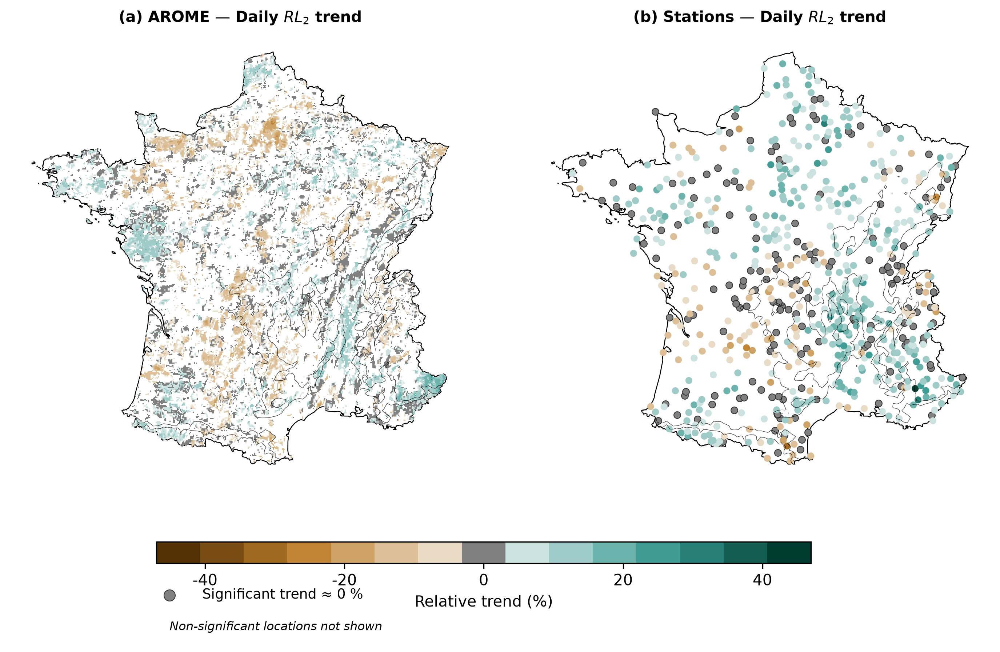
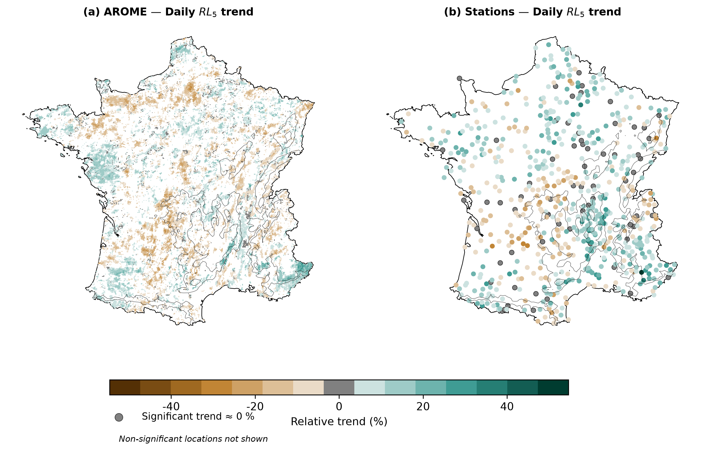
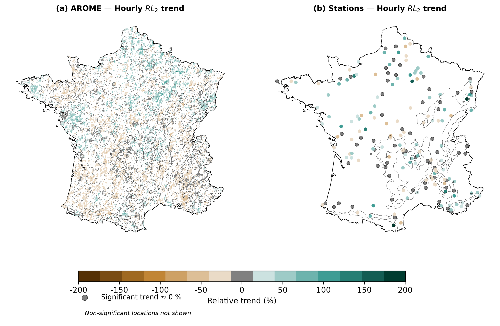
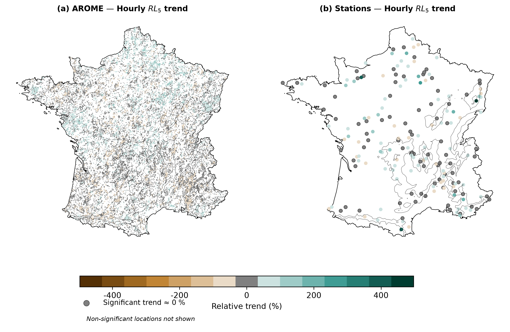

**Manuscript Title:** Climatology and trends of extreme precipitation in France: evaluation of an explicit-convection regional climate model

**Authors:** Nicolas Decoopman, Juliette Blanchet, Antoine Blanc, and Cecile Caillaud

**Journal:** Hydrology and Earth System Sciences (HESS)

We thank referee #2 for their constructive and detailed review of our manuscript. Below are our point-by-point responses to the comments, with line and figure numbers referring to the manuscript.

## General Comments

### Comment 1: Return Period Choice

_There is a 10-year return period chosen for both daily and hourly data, even though 10-year return period for hourly is much more extreme compared to daily given the amount of hourly data in a 10-year period compared to daily. Has a lower return value been tested? Given the noisy result, and the shorter period of data a better justification for the high return period for hourly data should be given, and it is of interest to show a lower return period._

* **Response:** We thank the reviewer for this comment. We agree that estimating a 10-year return period ($RL_{10y}$) at the hourly scale from a 33-year series (1990-2022) introduces significant sampling noise. As a sensitivity check, we have computed the trends for the 2-year and 5-year return levels ($RL_{2y}$ and $RL_{5y}$), which are closer to the center of the annual maxima distribution and thus more robustly estimated.

As shown in @fig-rl2-daily and @fig-rl5-daily (daily) and @fig-rl2-hourly and @fig-rl5-hourly (hourly), the spatial patterns of the $RL_{2y}$ and $RL_{5y}$ trends are very consistent with those of the $RL_{10y}$, with the same regional signals. Additionally, as shown in the response to Reviewer #1 (Comment 1), the GEV-estimated $RL_{2y}$ trend across all 1,558 daily stations is highly consistent with a simple linear regression on the annual maxima (Pearson $r = 0.88$ for relative trends), confirming that the trend patterns are not driven by GEV fitting uncertainty.

We have added a justification for the choice of the 10-year return period in the revised manuscript. The 10-year return level is retained as the primary metric because it is a standard design threshold in hydrology and because our daily series (63 years) and hourly series (33 years) provide sufficient data for its robust estimation. We chose not to include these lower-return-period maps as an additional appendix in order to keep the manuscript focused, but present them here for the reviewer's assessment.

\clearpage

{#fig-rl2-daily width=90%}

\clearpage

{#fig-rl5-daily width=90%}

\clearpage

{#fig-rl2-hourly width=90%}

\clearpage

{#fig-rl5-hourly width=90%}

\clearpage

**Manuscript modifications:**

- In `Section 3.2.3 (Trend in return level)`, we have added the justification for using the 10-year return level as the main indicator, while noting the consistency with lower return periods:

  > _"In this study, we focus on the 10-year return level ($\mathrm{RL}_{10}$) as the primary metric for extreme precipitation, as it represents a standard design threshold in hydrology. Our daily series (63 years) and hourly series (33 years) provide sufficient data for its robust estimation. As a sensitivity check, the trends of the 2-year and 5-year return levels ($\mathrm{RL}_{2}$ and $\mathrm{RL}_{5}$) show consistent spatial patterns, confirming that the detected signals are robust and not driven by GEV fitting uncertainty."_

### Comment 2: Introduction & Physical Processes

_Introduction: First paragraph introduces a lot of different processes that are not necessarily connected. For instance, global warming leads to an increase in surface temperature, but it's the temperature increase in the atmosphere that increases the water holding capabilities, and the energy balance is also between the top of atmosphere and surface (and everything in between). A lot of the statements in Introduction need a reference for instance line 47-50 and should include more research articles in addition on the IPCC 2021 report._

* **Response:** We agree that the physical description in the first paragraph was somewhat compressed and mixed different thermodynamic and dynamic concepts. In the revised manuscript, we have restructured this paragraph to:

1. Clarify the physical link: surface warming leads to atmospheric warming, which increases the water-holding capacity of the troposphere according to the Clausius-Clapeyron relationship, while the actual condensation and precipitation are driven by vertical motion and adiabatic cooling of ascending air masses.
2. Add more academic references (e.g., Trenberth et al. 2003, O'Gorman and Muller 2010, Westra et al. 2014) alongside the IPCC 2021 report to ground these statements in the literature.

**Manuscript modifications:**

- In `Section 1 (Introduction and context)`, the first paragraph has been restructured. The main changes are:

  - Replace _"Due to buoyancy (Archimedes' principle), warm air surrounded by cooler air tends to rise. As warm air ascends in the atmosphere, it undergoes adiabatic cooling, leading to the condensation of water vapor and the formation of precipitation (Lin, 2022)."_ with a clearer formulation that distinguishes thermodynamic and dynamic contributions.
  - Replace _"However, under calm conditions, the central portion of the precipitation distribution does not fully capitalize on this excess moisture."_ with _"However, for non-extreme or average precipitation events, [...]"_ to clarify the distinction between mean and extreme precipitation.
  - Add references: Trenberth et al. (2003), O'Gorman and Muller (2010), and Westra et al. (2014) alongside the existing IPCC (2021) and Clapeyron (1834) citations.
  - Replace _"sensitivities"_ (line 141) with _"temperature-scaling rates"_ (as also requested by Reviewer #1).

### Comment 3: Treatment of Aerosols and Solar Brightening

_Figure 2 and Figure 3: How much of the temperature trend could be caused by aerosol changes due to anthropogenic pollution? How is aerosol treated in AROME? The results in these plots indicate that there is an increase in temperature after the peak pollution in the 1980s and that the trend in 10-year return level is increasing after this peak. Even though aerosols are not included or kept constant in AROME, this should be stated and included in the discussion and limitations._

* **Response:** We would like to clarify that aerosols are **not** kept constant in this AROME simulation: they are monthly evolving and vary from year to year, taken from the ALDERA reanalysis (which uses an interactive aerosol scheme to capture historical variations, including the peak pollution in the 1980s and subsequent solar dimming/brightening, as described by Nabat et al. 2020). Green House Gases also evolve annually. In the revised manuscript, we have made this clearer in Section 2.2 and Section 5.1.1 (Discussion).

**Manuscript modifications:**

- In `Section 2.2 (CNRM-AROME model)` (line 183), the existing sentence _"Aerosols are monthly evolving and come from the ALDERA reanalysis, a CNRM-ALADIN simulation at 12 km driven by ERA5 with an interactive aerosol scheme (Nabat et al., 2020). Green House Gases are evolving annually."_ already states this. We have expanded it to explicitly mention the peak pollution and dimming/brightening:

  > _"Aerosols are monthly evolving and vary from year to year, taken from the ALDERA reanalysis, a CNRM-ALADIN simulation at 12 km driven by ERA5 with an interactive aerosol scheme that captures historical variations including the peak anthropogenic pollution in the 1980s and subsequent solar dimming/brightening (Nabat et al., 2020). Greenhouse gases also evolve annually."_

- In `Section 5.1 (Limitations of the study)`, after the existing paragraph on temperature trends (line 207: _"It should be noted that temperature trends [...] the magnitude of the trends we can detect."_), we have added:

  > _"The weaker simulated temperature trend suggests that either the model's sensitivity to radiative forcings or the boundary conditions provided by ERA5 lead to a dampened warming signal in France compared to observations. Since aerosols and greenhouse gases evolve realistically in this simulation (Section 2.2), the temperature trend underestimation likely stems from the model's internal sensitivity or from the driving reanalysis."_

### Comment 4: Visualization of Non-Significant Trends

_For the maps with stations, setting non-significant trends to zeros makes it difficult to differentiate with stations that have close to zero or zero significant trends and stations with strong trends that are non-significant. The authors should consider not showing the stations at all or choosing another marker. The size of the marker also seems to vary with the trend, which can make it look like the stations with strong trends are more numerous than they are._

* **Response:** We agree with the reviewer. Representing non-significant trends as zero makes it difficult to distinguish between a significant trend of 0% and a non-significant trend of 50%. To improve readability:

1. We represent non-significant stations using a small, neutral, light-grey dot to keep them visible as part of the network but clearly distinguish them from stations with significant trends.
2. As also requested by Reviewer 1, we keep the marker size constant for all stations to prevent visual bias towards larger circles, relying solely on color to represent the trend magnitude.

**Manuscript modifications:**

- In `Figures 6 and 7` (trend maps), we have changed the visualization: (i) all station markers now have a uniform size (instead of scaling with trend magnitude), and (ii) stations with non-significant trends are shown as small light-grey dots instead of being set to zero. This avoids confusing truly zero significant trends with large non-significant trends.

- The caption of Figure 6 has been updated. Original caption: _"Relative GEV trends over 1959–2022 in the 10-year return level of daily precipitation [...]."_ Updated caption adds: _"Only statistically significant trends (at the 10% level) are colored; stations with non-significant trends are represented by small light-grey dots."_

- The same changes have been applied to the caption of Figure 7 (hourly trends) and the monthly trend maps (Appendix C, Figure C1).

## Minor Comments

* **Why choose the hydrological year? The study itself does not take into account snowpack, and in addition the convective extreme precipitation can come in summer that in this study is over the start of the hydrological year (JAS, where summer usually is considered as JJA). This should be justified more.** 

  _Response:_ The choice of the hydrological year (September 1 to August 31) is standard in French climatology and hydrology, especially when studying extremes. The most intense extreme precipitation events in France, particularly the Mediterranean episodes ("episodes"), occur during autumn (September to November). Using a standard calendar year (January to December) risks splitting a single autumn convective season or grouping two distinct autumn seasons into the same year, which violates the independence assumption of annual maxima. Starting the year on September 1 ensures that the entire autumn convective season is kept intact within a single year. We have added this explanation to the methodology section to justify our choice.

  **Manuscript modifications:**
  In `Section 3 (Methodology)`, after the definition of the time periods (line 219: _"The evaluation is conducted over [...] and month."_), we have added the following justification:

  > _"The hydrological year (September to August) is used instead of the calendar year, which is standard in French climatology and hydrology. This choice is motivated by the fact that the most intense extreme precipitation events in France, particularly Mediterranean episodes (e.g., Cévenol events), occur during autumn (September–November). Using a calendar year would risk splitting these autumn events across two years, violating the block-independence assumption required for annual maxima GEV modeling."_

* **It can be confusing in the text with GEV models and Arome model, could consider naming one different.** 

  _Response_: We agree. In the revised text, we refer to CNRM-AROME as the "climate model/simulation" and to the GEV models as "statistical models/distributions" to avoid any confusion.

  **Manuscript modifications:**
  Throughout the manuscript, we have revised the terminology to prevent confusion between the climate model and the extreme value models. Specifically:
  - We refer to CNRM-AROME as the "CP-RCM", "climate model", or "simulation".
  - We refer to GEV models ($M_0$ to $M_3^*$) as "statistical models" or "statistical GEV distributions".

* **Too little font in Figure 8**

  *Response*: Figure 8 has been moved to the Appendix, where it can be displayed at a larger scale and read more easily.

  **Manuscript modifications:**
  Figure 8 (monthly GEV trend synthesis) has been relocated to the Appendix to improve readability.

